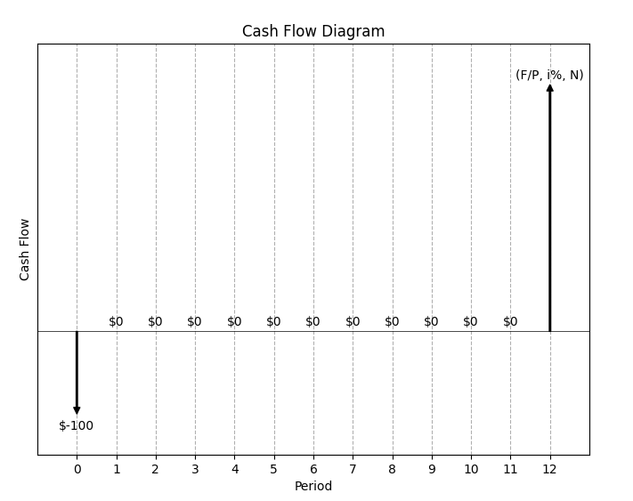
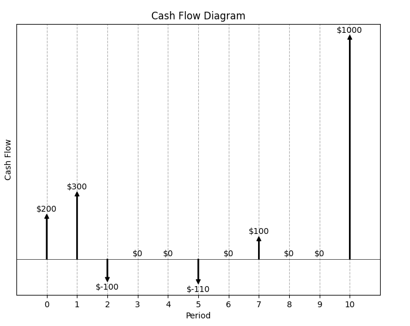
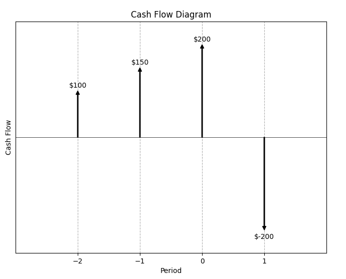
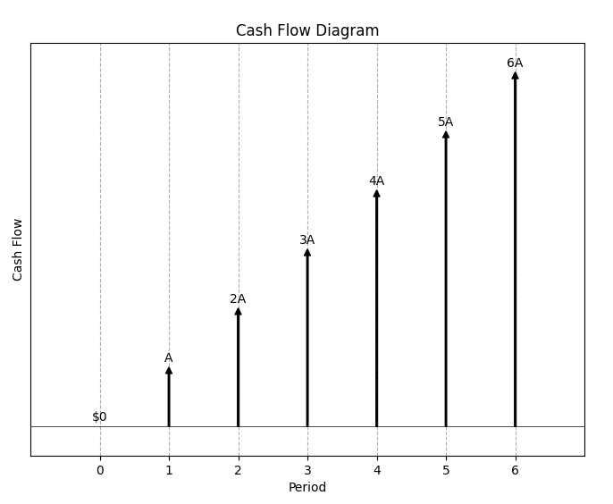

# Cashflow Diagrams README

This is a tool to easily generate cashflow diagrams. I made it because I got sick of drawing them on draw.io.

## Setup

Uses Python and matplotlib. It was developed and tested on Python 3.10 but lower versions might work too.
Ensure your terminal can pick up python by running ```python --version``` and ensuring you get some output.

Note: this was developed on Windows so if you're using a Mac it may or may not be a bit janky. It should work just the same, but I haven't tested it. If you're running into problems, open up an issue on GitHub.

Steps:

1. Clone/download the repository
2. For Windows:
   1. Open a powershell terminal in this directory
   2. Run the setup script using ```.\setup.ps1```
3. For Mac:
   1. Open a bash terminal in this directory
   2. Run the setup script using ```. setup.sh```

## Usage

1. Enter the periods and amounts in ```config.py```
2. Save the file
3. Run the cashflow.py script
   1. Windows: ```.\run``` in powershell
   2. Mac: ```. run.sh``` in Terminal
4. By default, the arrows are annotated by the cash amounts
   - If you want to override any particular arrow annotation with your own, add it to the ```annotations``` structure in ```config.py```
6. When you run the script, the timestamped output image is also saved in the ```cashflow_images``` directory
   - The last 5 images generated are maintained
   - You don't need to create the folder, if it doesn't find the folder the script will create that automatically

(Note: You have the option of running the script manually using ```python -m cashflow```, but ensure you activate the virtual environment created by the setup script.)

## Examples

For each example the ```config.py``` contents and the output it produces are shown.

### #1

```
config = {
    "0": -100,
    "12": 300,
}

annotations = {
    "12": "(F/P, i%, N)"
}
```




### #2

```
config = {
    "0": 200,
    "1": 300,
    "2": -100,
    "5": -110,
    "7": 100,
    "10": 1000
}

annotations = {

}
```



### #3

```
config = {
    "-2": 100,
    "-1": 150,
    "0": 200,
    "1": -200
}

annotations = {

}
```



### #4

```
config = {
    "0": 0,
    "1": 100,
    "2": 200,
    "3": 300,
    "4": 400,
    "5": 500,
    "6": 600,
}

annotations = {
    "1": "A",
    "2": "2A",
    "3": "3A",
    "4": "4A",
    "5": "5A",
    "6": "6A",
}
```
